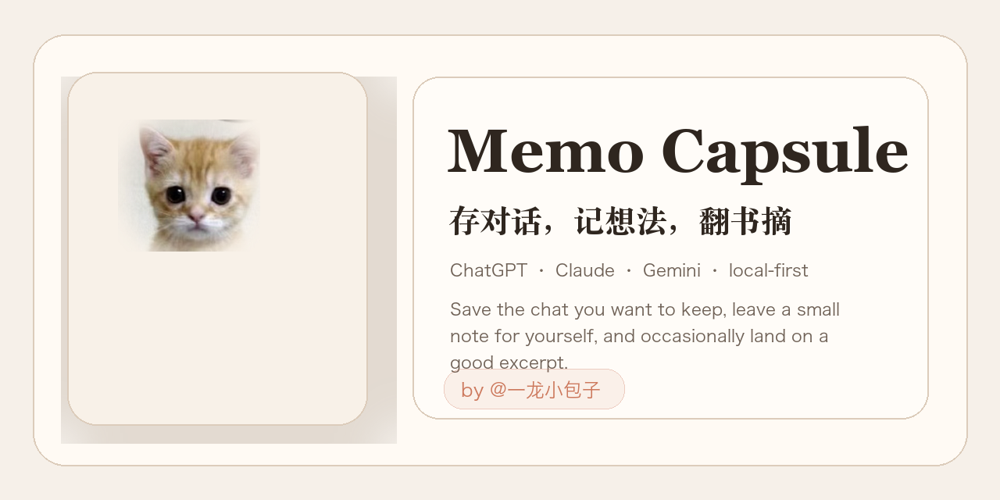

# Memo Capsule

存对话，记想法，翻书摘。

## What This Does

`Memo Capsule` 是一个本地优先的浏览器插件，放在 `ChatGPT / Claude / Gemini` 的对话页右侧。

它只做三件事：

- 保存当前对话到本地归档
- 在角落留一条你自己的临时便签
- 在你没写便签时，允许切到一条来自 `@一龙小包子` 的随机书摘

它不是全量账号导出工具，也不是知识库。它更像一个轻量暂存盒：先保存，先浏览，真正重要的再导出。

## Key Features

- `Save-first`：先把当前会话保存到本地，再决定要不要导出
- `Editable titles`：归档后的对话标题可以直接改名
- `YOU / AI`：统一角色标签，不再猜模型型号
- `Memo + excerpt`：折叠态优先显示便签；如果你手动切到随机书摘，就显示正文和统一的 `书摘精选 · 书摘精选`；两者都没有时显示完整小猫
- `Local-only`：仅在你主动点击保存时读取当前页面内容，数据只留在浏览器本地

## Installation

1. 打开 `chrome://extensions`
2. 打开右上角 `开发者模式`
3. 点击 `加载已解压的扩展程序`
4. 选择仓库里的 `extension/` 文件夹

## Usage

### Save a chat

1. 打开要保存的 `ChatGPT / Claude / Gemini` 对话
2. 往上滚几次，确保更早的消息已经加载
3. 点击右下角保存角标，或点击浏览器工具栏里的扩展图标
4. 当前会话会先进入本地归档

### Browse and export

1. 打开面板
2. 点 `历史存档`
3. 在右侧浏览完整上下文
4. 按需导出 `Markdown` 或 `TXT`

### Use the memo surface

1. 在输入框里写一句临时便签
2. 点 `保存`
3. 面板会直接折叠，便签出现在缩起卡片上

如果你不想显示便签，可以点 `换一条随机书摘`；书摘卡片右下角有 `↻` 可继续随机刷新，也有 `→` 可临时切回小猫态；如果想把内容真正清空，点 `清空`。

## Why The Name

- `Memo` 指的是你在 AI 页面里那一小块属于自己的地方
- `Capsule` 指的是一条被收起来、可以稍后再打开的上下文

这个名字故意不只指向聊天导出，因为它从一开始就是二合一：对话暂存 + 小块 memo 展示。

## Architecture

- `extension/content.js`：页面 UI、对话提取、本地归档、便签历史
- `extension/excerpts.js`：由 corrected 精选源文件生成的书摘数据
- `extension/background.js`：工具栏点击后的一键保存
- `extension/manifest.json`：权限、注入范围、扩展图标
- `extension/assets/cat-save.png`：小猫缩起入口资源
- `assets/github-cover.png`：GitHub 封面图

## Philosophy

1. 这是一块留给你的地方，不是另一个工具栏。
2. 等待 AI 回复的几秒钟，可以顺手记一笔，也可以翻到一句人写的话。
3. 重要内容先被你选中，再被保存；不是默认把一切都抓走。
4. 保持轻量，比堆很多生产力功能更重要。

## Requirements

- `Chrome` 浏览器
- 已完整加载的聊天页面
- 对话归档上限 `100` 条，便签记录上限 `100` 条

达到 `80` 条后会提示你导出和清理；达到 `100` 条后会自动替换最早的一条。

## Credits

- 视觉和交互方向参考了更像阅读工具、而不是下载工具的 memo 类产品
- README 结构延续了 `zarazhangrui/frontend-slides` 那种项目首页组织方式
- 书摘由 `@一龙小包子` 提供和筛选

## License

License is not defined yet.
